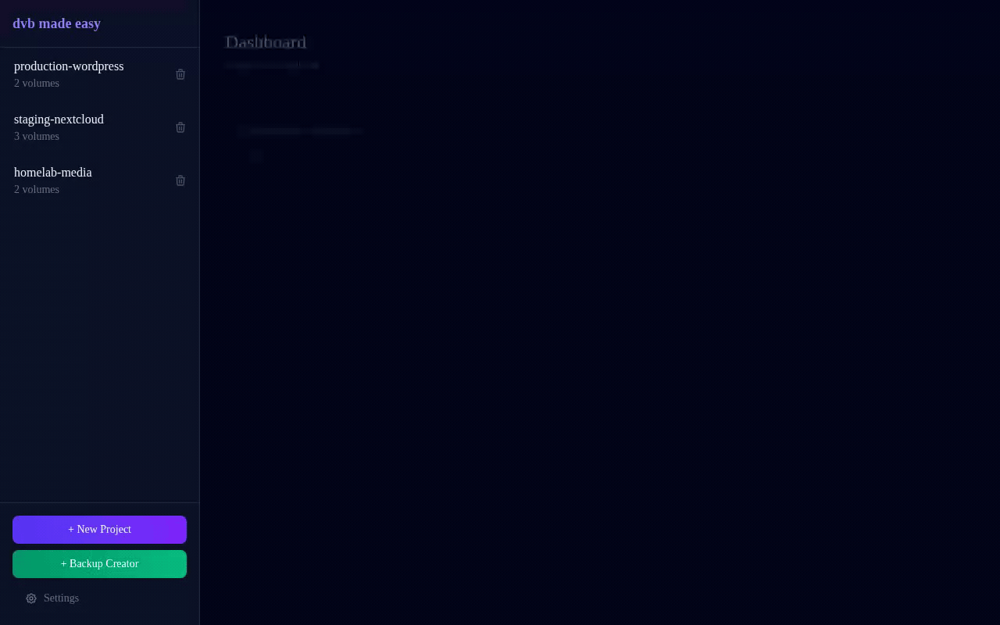
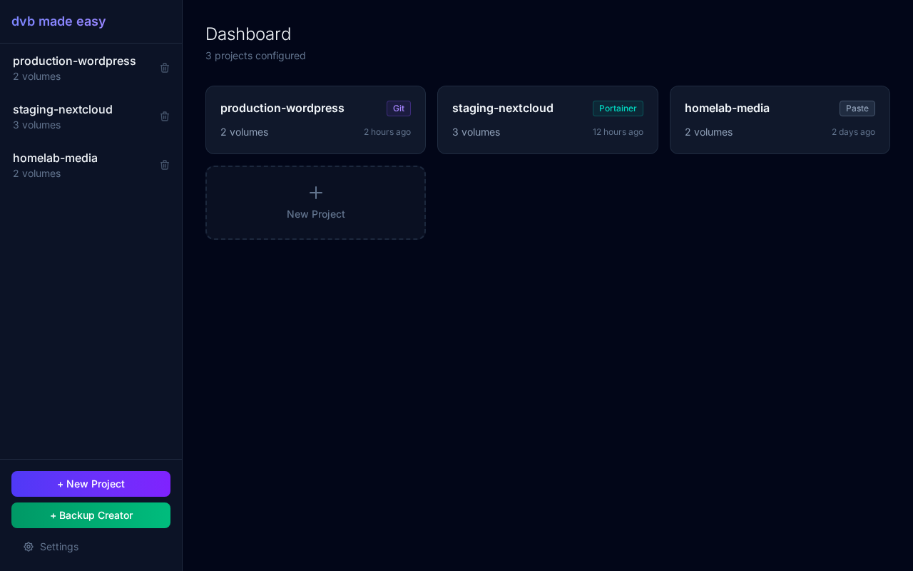
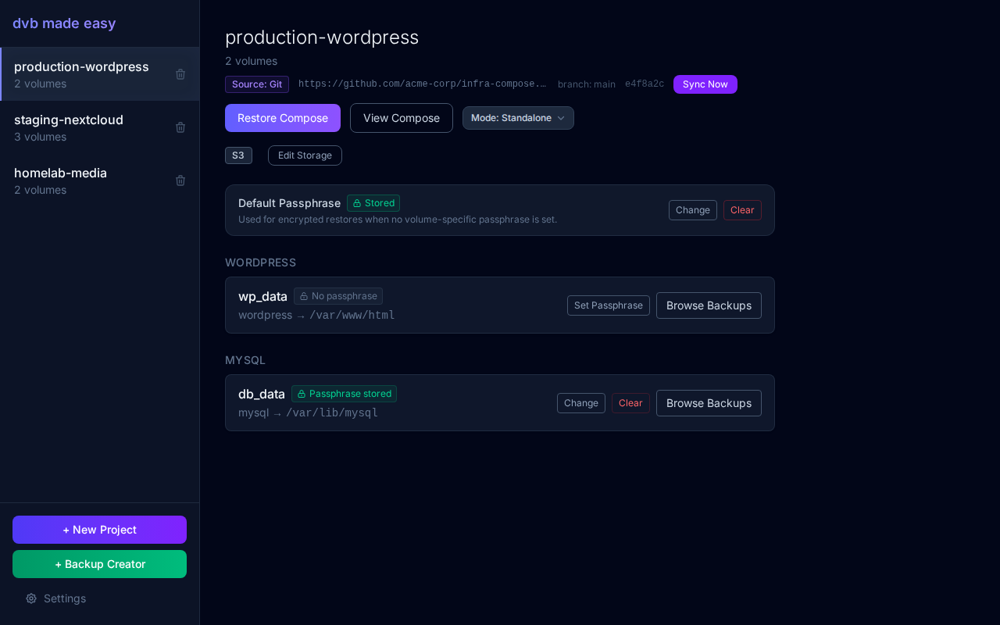
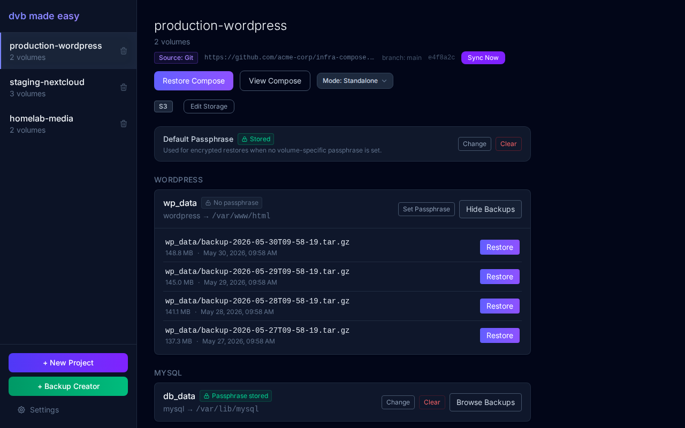
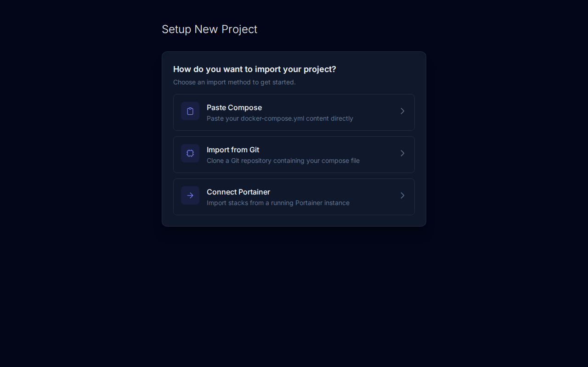
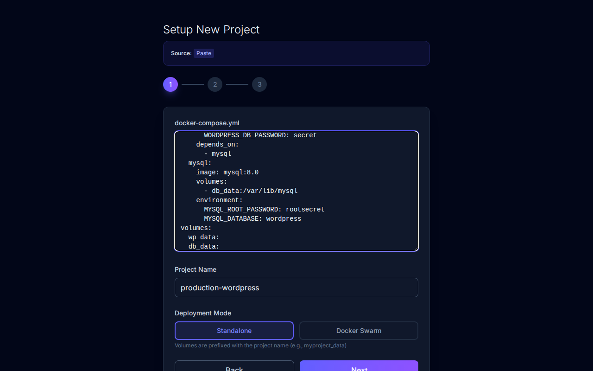
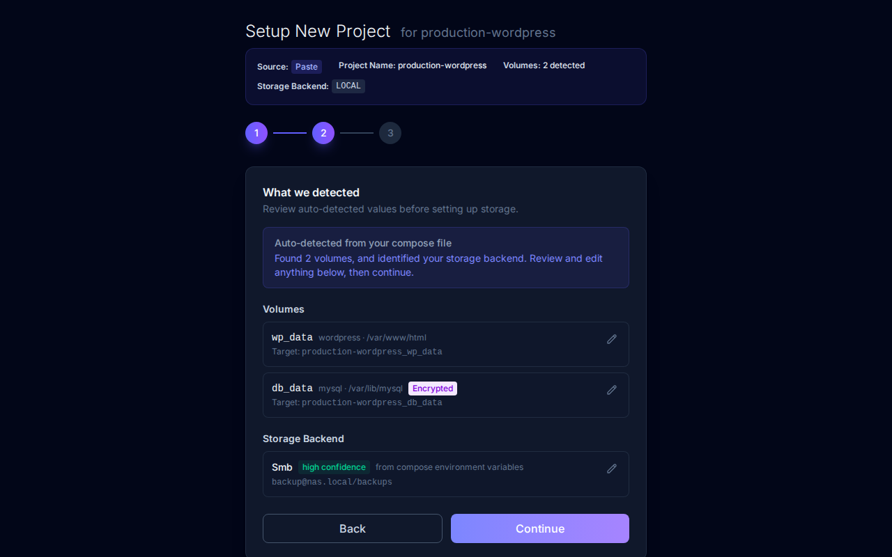
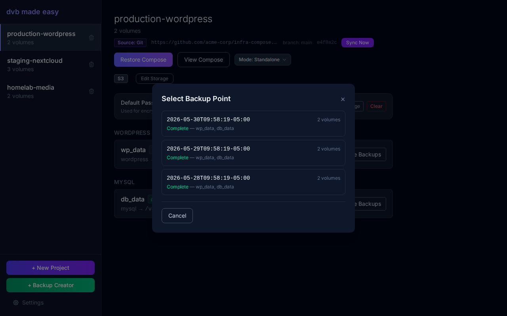

# DVB Made Easy

[](https://github.com/bocklucas/dvb-made-easy/actions/workflows/ci.yml)
[](https://github.com/bocklucas/dvb-made-easy/releases/latest)
[](https://ghcr.io/bocklucas/dvb-made-easy)
[](https://github.com/bocklucas/dvb-made-easy/blob/main/LICENSE)
[](https://github.com/bocklucas/dvb-made-easy/stargazers)

[](https://golang.org)
[](https://kit.svelte.dev)
[](https://tailwindcss.com)
[](https://www.docker.com)
[](#)
[](#)
[](#)
[](#)

A lightweight, self-hosted web UI for restoring Docker volume backups created by [offen/docker-volume-backup](https://github.com/offen/docker-volume-backup).



> [!NOTE]
> This project was co-authored with **Claude** and **Anti-Gravity**.

> [!WARNING]
> **Early-Stage Software** — Functional and used in real environments, but you may encounter rough edges. This tool interacts directly with Docker volumes and container lifecycles — **back up your data independently** before relying on it for critical restores. Test against non-production volumes first. Bug reports welcome at [Issues](https://github.com/bocklucas/dvb-made-easy/issues).

> [!CAUTION]
> **No built-in authentication.** Requires direct access to the Docker socket (`/var/run/docker.sock`), which grants full control over the Docker daemon (effectively root on the host).
> - **Never expose this application to the public internet.**
> - Secure it behind a VPN or authenticating reverse proxy (Authelia, Authentik, Cloudflare Access, etc.).

---

## Table of Contents

- [Features](#features)
- [Screenshots](#screenshots)
- [Quick Start](#quick-start)
- [Local Development (Docker Compose)](#local-development-docker-compose)
- [Local Development (No Docker)](#local-development-no-docker)
- [Security Model](#security-model)
- [FAQ & Troubleshooting](#faq--troubleshooting)

---

## Features

- **Flexible Project Import** — Paste a `docker-compose.yml`, import from a Git repository (HTTPS tokens / SSH keys), or connect to Portainer to auto-discover stacks.
- **Encrypted Passphrase Storage** — Volume and project-wide GPG passphrases are persisted in an AES-256-GCM encrypted manifest that survives container restarts.
- **Automated Volume Restore** — Restore into the original volume or create a new one (e.g. `{volume}_restored_{timestamp}`) for safe inspection before replacing production data.
- **Swarm & Compose Orchestration** — Scales down Swarm services or stops Compose containers before restoring, then brings everything back up automatically.
- **Real-Time Progress** — Server-Sent Events stream live percentages, logs, and container state transitions to the UI.
- **Multi-Backend Storage** — Local directory, SMB/CIFS, AWS S3 / MinIO, WebDAV (Nextcloud), SFTP, Azure Blob, Dropbox, and Google Drive.
- **Sidecar Backup Generator** — A configuration wizard that generates and injects the `offen/docker-volume-backup` sidecar service into your compose file, with schedule, retention, encryption, and storage settings.

---

## Screenshots

<details>
<summary><strong>Dashboard</strong> — All your projects at a glance</summary>



</details>

<details>
<summary><strong>Project Detail</strong> — Volumes, passphrases, and storage configuration</summary>



</details>

<details>
<summary><strong>Browse Backups</strong> — List available backups per volume with one-click restore</summary>



</details>

<details>
<summary><strong>Setup Wizard</strong> — Choose your import method (Paste, Git, or Portainer)</summary>





</details>

<details>
<summary><strong>Restore Progress</strong> — Real-time streaming of every step</summary>


</details>

<details>
<summary><strong>Compose Restore</strong> — Select a backup point to restore all volumes at once</summary>



</details>

---

## Quick Start

Single command — no cloning required:

```bash
curl -sL https://raw.githubusercontent.com/bocklucas/dvb-made-easy/main/docker-compose.prod.yml -o docker-compose.yml && docker compose up -d
```

Or run directly without a compose file:

```bash
docker volume create dvb-restore-staging

docker run -d -p 7331:7331 \
  -v /var/run/docker.sock:/var/run/docker.sock \
  -v dvb-config:/app/config \
  -v dvb-restore-staging:/staging \
  ghcr.io/bocklucas/dvb-made-easy:latest
```

Then open [http://localhost:7331](http://localhost:7331).

> [!TIP]
> If you get a "permission denied" error for the Docker socket, add your Docker group ID:
> ```bash
> docker run -d -p 7331:7331 \
>   -v /var/run/docker.sock:/var/run/docker.sock \
>   -v dvb-config:/app/config \
>   -v dvb-restore-staging:/staging \
>   --group-add $(getent group docker | cut -d: -f3) \
>   ghcr.io/bocklucas/dvb-made-easy:latest
> ```

---

## Local Development (Docker Compose)

```bash
git clone https://github.com/bocklucas/dvb-made-easy.git
cd dvb-made-easy

export DOCKER_GID=$(getent group docker | cut -d: -f3)
docker compose up -d
```

- **Web UI**: [http://localhost:7331](http://localhost:7331)
- **API Health**: [http://localhost:7331/api/health](http://localhost:7331/api/health)

---

## Local Development (No Docker)

### Prerequisites
- Go 1.26+
- Node.js 22+
- Access to a local Docker daemon (`/var/run/docker.sock`)

### 1. Start the Go Backend
```bash
go run cmd/server/main.go --port 7331 --config-dir ./config-dev --staging-dir ./staging-dev
```

### 2. Start the Frontend Dev Server
```bash
cd web
npm install
npm run dev
```

Open [http://localhost:5173](http://localhost:5173) — the Vite dev proxy forwards `/api` requests to the Go backend on port 7331.

---

## Security Model

### Encrypted Manifest
- A 32-byte key is generated on first start and saved as `/app/config/.key` (mode `0600`).
- All credentials (SMB, Git tokens, GPG passphrases) are encrypted with **AES-256-GCM** and stored in `manifest.enc`.
- **Back up your `.key` file** — without it, the manifest cannot be decrypted.

### Docker Socket Access
- The app needs `/var/run/docker.sock` to inspect containers and run extraction helpers. Docker socket access is equivalent to root on the host.
- **No built-in authentication** — restrict access to a trusted local network, VPN, or authenticating reverse proxy.

---

## FAQ & Troubleshooting

**"permission denied" on `/var/run/docker.sock`**
Set the `DOCKER_GID` environment variable before running `docker compose up`, or add `--group-add` when using `docker run`.

**How do I restore into a different volume name?**
Select **New Volume Mode** during the restore flow. It defaults to `{volume_name}_restored_{timestamp}` but can be customized to any name.

**How does GPG decryption work?**
The UI shows a lock icon when it detects `.gpg` files. You can store the passphrase in the encrypted manifest or enter it at restore time. The helper container handles decryption automatically.
